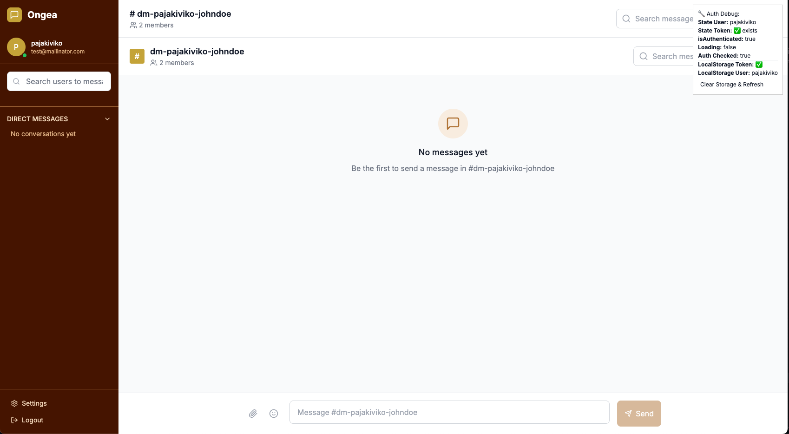

# Real-Time Communication with Socket.io Chat Application

## 🚀 Project Overview
This project is a real-time chat application built using Socket.io, demonstrating bidirectional communication between clients and the server. It implements features such as live messaging, notifications, and online status updates, providing a dynamic and interactive user experience.

## ✨ Features Implemented

### Core Functionality
*   **Live Messaging:** Users can send and receive messages in real-time.
*   **User Authentication:** Simple username-based or JWT authentication for secure access.
*   **Global Chat Room:** A public channel where all connected users can communicate.
*   **Typing Indicators:** Displays when a user is actively composing a message.
*   **Online/Offline Status:** Shows the current availability of users.

### Advanced Features
*   **Private Messaging:** Enables one-on-one conversations between users.
*   **Multiple Chat Rooms/Channels:** Supports various channels for organized discussions.
*   **Real-Time Notifications:**
    *   New message alerts.
    *   User join/leave notifications for chat rooms.
    *   Unread message count display.
    *   Sound notifications for new messages.
    *   Browser notifications (using Web Notifications API).

### Performance and UX Optimization
*   **Message Pagination:** Efficiently loads older messages to improve performance.
*   **Reconnection Logic:** Handles disconnections gracefully, ensuring a seamless user experience.
*   **Socket.io Optimization:** Utilizes namespaces and rooms for efficient communication.
*   **Message Delivery Acknowledgment:** Confirms successful message delivery.
*   **Responsive Design:** Ensures the application works well across desktop and mobile devices.

## 🛠️ Technologies Used
*   **Backend:** Node.js, Express, Socket.io
*   **Database:** MongoDB (inferred from project structure)
*   **Frontend:** React, Socket.io Client
*   **Styling:** Tailwind CSS (inferred from `client/tailwind.config.js`)

## ⚙️ Setup Instructions

1.  **Prerequisites:**
    *   Ensure you have Node.js installed (v18+ recommended).
    *   MongoDB instance (local or cloud-based) accessible.

2.  **Clone the repository:**
    ```bash
    git clone https://github.com/PLP-MERN-Stack-Development/real-time-communication-with-socket-io-Nashon-Juma.git
    cd real-time-communication-with-socket-io-Nashon-Juma
    ```

3.  **Install server dependencies:**
    ```bash
    cd server
    npm install
    ```
    *   Create a `.env` file in the `server` directory based on `server/.env.example` and configure your MongoDB URI and JWT secret.

4.  **Install client dependencies:**
    ```bash
    cd ../client
    npm install
    ```
    *   Create a `.env` file in the `client` directory based on `client/.env.example` and configure your API base URL (e.g., `VITE_API_BASE_URL=http://localhost:5000`).

5.  **Start the development servers:**
    *   **In the server directory:**
        ```bash
        npm run dev
        ```
    *   **In the client directory:**
        ```bash
        npm run dev
        ```

    The client application will typically run on `http://localhost:5173` and the server on `http://localhost:5000`.

## 📂 Project Structure
```
.
├── .gitignore
├── README.md
├── Week5-Assignment.md
├── client/
│   ├── .env
│   ├── .gitignore
│   ├── index.html
│   ├── package-lock.json
│   ├── package.json
│   ├── postcss.config.js
│   ├── tailwind.config.js
│   ├── vite.config.js
│   ├── src/
│   │   ├── App.jsx
│   │   ├── main.jsx
│   │   ├── components/
│   │   │   ├── DebugAuth.jsx
│   │   │   ├── chat/
│   │   │   │   ├── Message.jsx
│   │   │   │   ├── MessageInput.jsx
│   │   │   │   ├── MessageList.jsx
│   │   │   │   └── TypingIndicator.jsx
│   │   │   ├── common/
│   │   │   │   └── ProtectedRoute.jsx
│   │   │   ├── layout/
│   │   │   │   ├── Header.jsx
│   │   │   │   ├── Layout.jsx
│   │   │   │   └── Sidebar.jsx
│   │   │   └── users/
│   │   │       └── UserSearch.jsx
│   │   ├── context/
│   │   │   ├── AuthContext.jsx
│   │   │   ├── ChatContext.jsx
│   │   │   ├── NotificationContext.jsx
│   │   │   └── SocketContext.jsx
│   │   ├── hooks/
│   │   │   ├── useDebounce.js
│   │   │   ├── useLocalStorage.js
│   │   │   └── useSocket.js
│   │   ├── pages/
│   │   │   ├── Channel.jsx
│   │   │   ├── Chat.jsx
│   │   │   ├── DirectMessages.jsx
│   │   │   ├── Login.jsx
│   │   │   └── Settings.jsx
│   │   ├── services/
│   │   │   ├── api.js
│   │   │   ├── authService.js
│   │   │   ├── channelService.js
│   │   │   ├── index.js
│   │   │   ├── messageService.js
│   │   │   └── userService.js
│   │   ├── socket/
│   │   │   └── socket.js
│   │   └── styles/
│   │       └── index.css
└── server/
    ├── .env
    ├── .env.example
    ├── .gitignore
    ├── package-lock.json
    ├── package.json
    ├── server.js
    ├── config/
    │   ├── cors.js
    │   ├── database.js
    │   └── socket.js
    ├── controllers/
    │   ├── authController.js
    │   ├── channelController.js
    │   ├── messageController.js
    │   └── userController.js
    ├── middleware/
    │   ├── auth.js
    │   ├── authSocket.js
    │   ├── errorHandler.js
    │   └── rateLimiter.js
    ├── models/
    │   ├── Channel.js
    │   ├── index.js
    │   ├── Message.js
    │   └── User.js
    ├── routes/
    │   ├── auth.js
    │   ├── channels.js
    │   ├── index.js
    │   ├── messages.js
    │   └── users.js
    ├── scripts/
    │   └── seedDatabase.js
    ├── socket/
    │   ├── index.js
    │   ├── handlers/
    │   │   ├── authHandler.js
    │   │   ├── channelHandler.js
    │   │   ├── messageHandler.js
    │   │   ├── typingHandler.js
    │   │   └── userHandler.js
    │   └── middleware/
    │       └── authSocket.js
    └── utils/
        └── validators.js
```

## 📸 Screenshots/GIFs

*(Add screenshots or GIFs of the application here to showcase its features)*

## 🚀 Deployment (Optional)
*   **Server Deployment:**
    *   Deploy the server to a service like Render, Railway, or Heroku.
    *   *(Add deployed server URL here)*
*   **Client Deployment:**
    *   Deploy the client to Vercel, Netlify, or GitHub Pages.
    *   *(Add deployed client URL here)*
